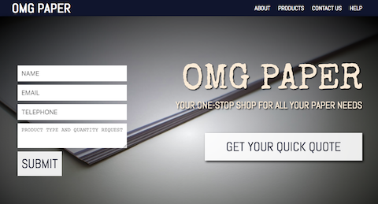

# PAPER COMPANY PROJECT

### DESCRIPTION
Assignment: to design and mock up a faux company website, utilizing all skills learned in JS, CSS, and HTML.
This is my first site ever utilizing these languages. There's no functionality yet to the site. This is just a front-page design.

### DESIGN
This site was designed with simplicity in mind. I wanted it to look like other start-up sites: sleek and simple. My company, OMG Paper is a B to B company providing services to other companies' paper needs.

### LANGUAGES USED
HTML, CSS, JAVASCRIPT

### FEATURES
Fun things to note:

- "Get Quote" pulls up form. Clicking submit prompts an alert.
- Animations are prompted my y-axis scroll
- Using parallax on a website is fun!

### RESOURCES

For this project, the following resources and frameworks were utilized in building the site:

- [Animate CSS](https://daneden.github.io/animate.css/): tool for simple site animations
- [Font Awesome](https://fontawesome.com/icons?d=gallery): specialized icons!

## CREDITS
Karl Rodulfo
